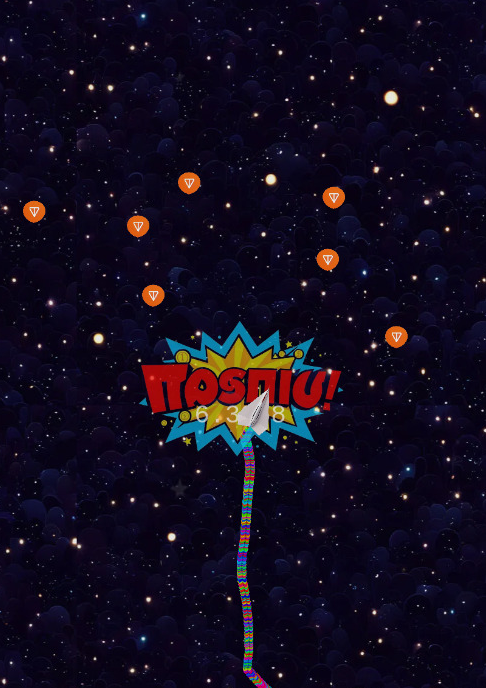
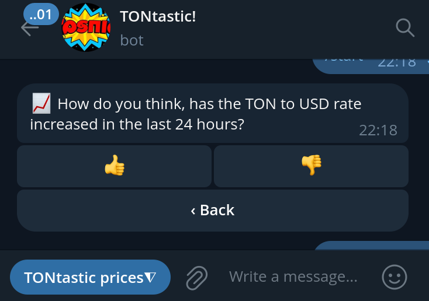
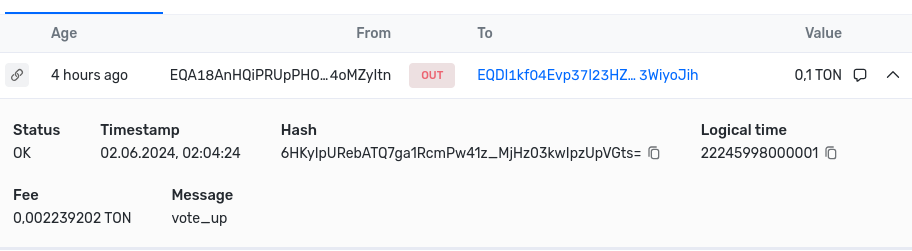

# TONtastic!

*TONtastic!* is a project built for the [ETH Belgrade Hackathon](https://ethbelgrade.rs/hackathon),
showcasing the integration with the [TonTeeTon](https://github.com/tonteeton/tonteeton) oracle.





*TONtastic!* is a gamified Telegram quiz app where users vote on whether the TON to USD rate has increased or decreased in the last 24 hours. Correct answers earn users TON Jettons as rewards, promoting engagement without requiring any staking.

The Telegram bot is available at https://t.me/TONtasticBot .

## Content

### Quiz contract

The [Contract](contracts/contract.tact) allows users to receive *TONtastic!* rewards for correctly answering the quiz question: "Has the TON to USD rate increased in the last 24 hours?" Upon voting UP or DOWN, the contract interacts with the TonTeeTon [get-simple-price](https://github.com/tonteeton/tonteeton/blob/main/enclaves/get-simple-price/contracts/contract.tact) contract to request the current TON price.

### Telegram bot

The [Bot](bot/) utilizes [TON Connect](https://docs.ton.org/develop/dapps/ton-connect/overview) to
allow users to make votes via an existing TON wallet.

### Telegram Mini App

The [TMA](src/) allows users to monitor the current TON price change in real-time, utilizing the Bybit API.


## Templates used

- [Phaser Webpack Template](https://github.com/phaserjs/template-webpack/)
- [Telegram Mini Apps Basic Example](https://github.com/telegram-mini-apps-dev/vanilla-js-boilerplate/tree/master)
- [aiogram TON Connect UI example](https://github.com/nessshon/aiogram-tonconnect/tree/main/aiogram_tonconnect)

## Development Setup

1. Clone the repository
```bash
git clone https://github.com/tonteeton/tontastic.git
```

2. Start the dev server
```bash
docker-compose up
```
